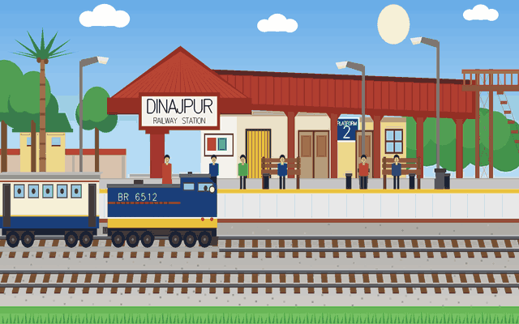
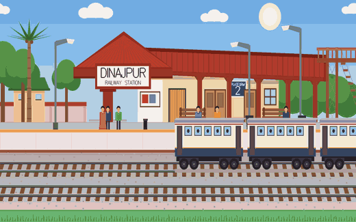
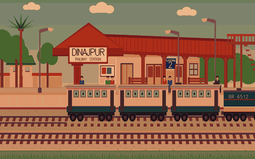
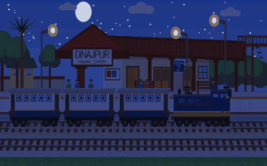
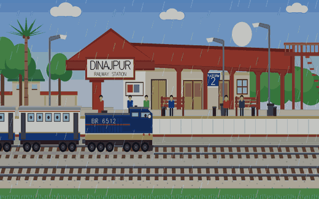
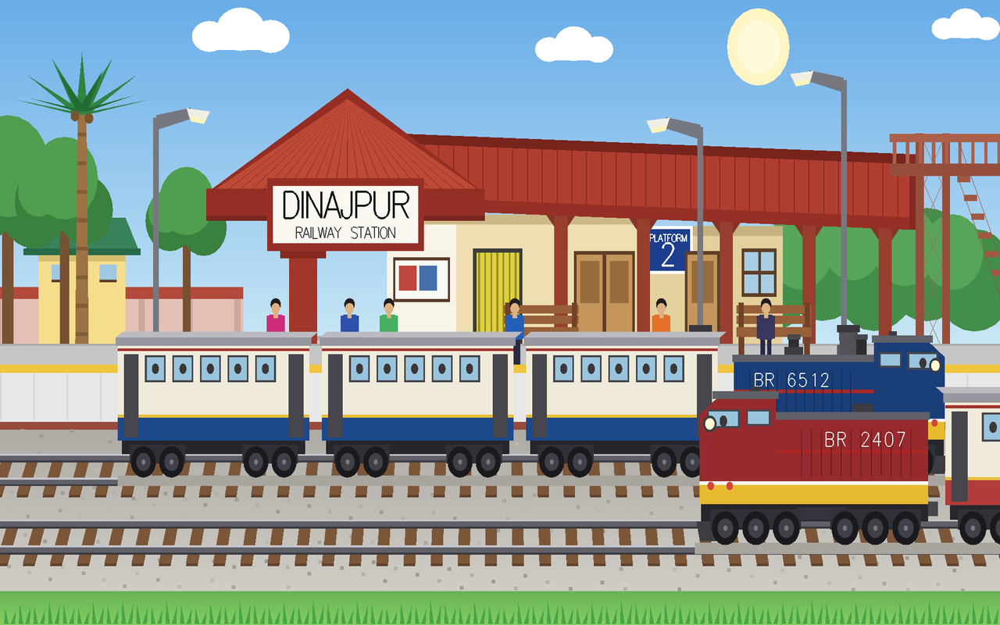
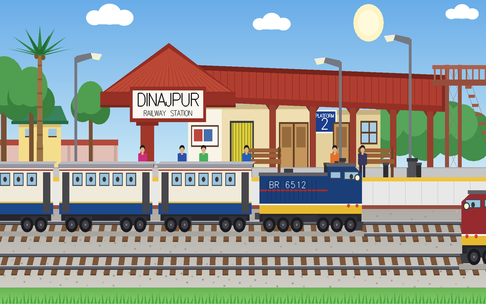
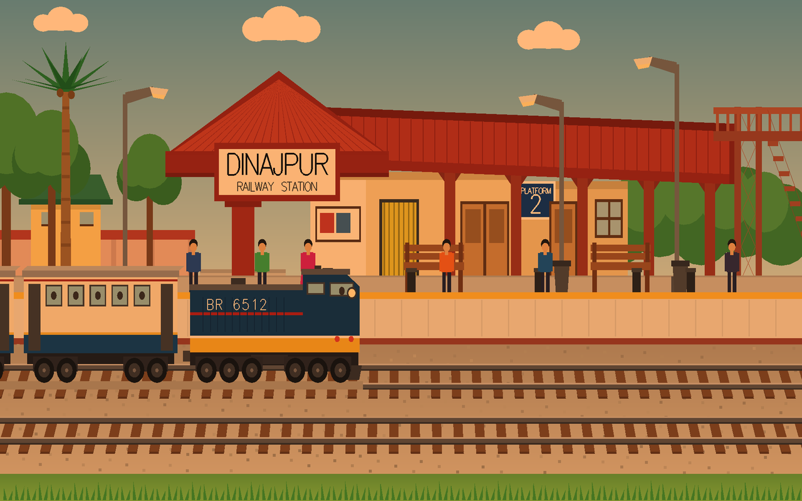
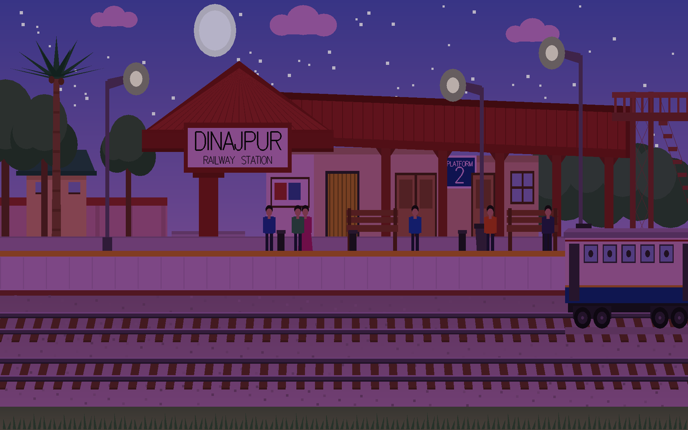
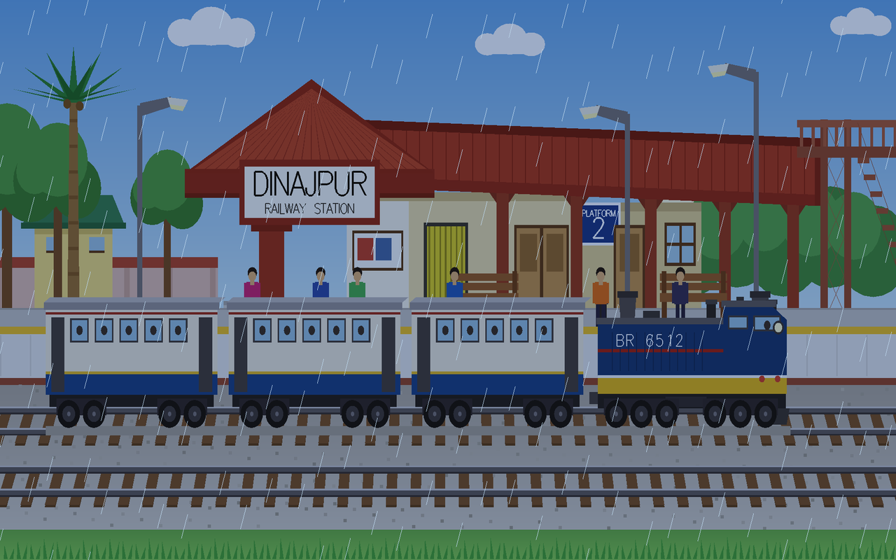

<h1 align="center">🚉 Dinajpur Railway Station</h1>

<p align="center">
  <b>A 2D animated railway station, drawn entirely in immediate-mode OpenGL.</b><br>
  No sprites, no textures, no image files — every roof, wheel and passenger is geometry.
</p>

<p align="center">
  
  
  
  
</p>

<p align="center">
  
  
  
  
</p>

<p align="center">
  
</p>

---

## Table of contents

- [What this is](#what-this-is)
- [Watch it with sound](#watch-it-with-sound)
- [The scene, moving](#the-scene-moving)
- [Controls](#controls)
- [Features](#features)
- [Build and run](#build-and-run)
- [How it works](#how-it-works)
- [Engineering notes](#engineering-notes)
- [Project documents](#project-documents)
- [Repository layout](#repository-layout)

---

## What this is

A university Computer Graphics project: **one `.cpp` file** that opens a window and draws Dinajpur
Railway Station — the building, the canopy, the foot-over-bridge, the platform, two tracks and the
land around them.

Nothing in the window is a photograph or an image file. Every shape is a list of corner points
handed to OpenGL. The picture is thrown away and rebuilt from scratch about **33 times a second**,
and because a handful of numbers change a little between one rebuild and the next, the eye sees
movement.

The scene runs through its own day, plays the right sound for the hour, and answers four keys.

## Watch it with sound

The GIFs below are silent — the format has no audio track. This is the same scene as a video, so you
can hear it: the station ambience under the day, the evening bed, the whistle as the through train
comes past, and the crickets at night. **47 seconds, two full turns of the clock.**

https://github.com/user-attachments/assets/53300ac4-3a24-42d8-b5bc-5bd2ef13da30

<p align="center">
  <sub>▶️ Press play — your browser won't start it with sound on its own.
  The file also lives in the repo, at <a href="screenshots/station_tour.mp4"><code>screenshots/station_tour.mp4</code></a>.</sub>
</p>

<sub>Nothing is faked for the recording: the video is the real program rendered frame by frame at its
own 33 fps, and the sound is the project's own five <code>.wav</code> files, cut at the exact moments
<code>update()</code> swaps them. The quiet stretch after the whistle is real too — <code>PlaySound</code>
plays one sound at a time, so the looping bed only comes back once the through train is clear.</sub>

## The scene, moving

Nobody touches a key for any of these. The hour turns on its own — **day → evening → night → day**,
about 7.8 seconds each — and the light *travels* to the next colour one small step per frame, so
every one of these is a fade, not a switch.

| | |
|:--:|:--:|
| <br>**Day → evening.** The white light warms to orange, the sun starts down. | <br>**Evening → night.** Orange drains to blue; moon, 80 stars and three lamp glows fade up. |
| <br>**Night → day.** The blue lifts, the stars and the lamp glow fade out, the sun climbs back. | <br>**Rain**, on the <kbd>R</kbd> key. The daylight greys down, 280 streaks fall — and the clock stops until <kbd>R</kbd> again. |

<p align="center">
  <br>
  <sub><b>Both trains on the tracks.</b> The red one is the blue one, mirrored with a negative scale —
  the same function, called twice.</sub>
</p>

<details>
<summary><b>Single frames</b> — day · evening · night · rain, if the animations are slow to load</summary>

| | |
|:--:|:--:|
| <br>**Clear day** | <br>**Evening** |
| <br>**Night** | <br>**Rain** |

</details>

## Controls

<div align="center">

| Key | What it does |
|:---:|:---|
| <kbd>↑</kbd> | start the platform train |
| <kbd>↓</kbd> | stop it at the station |
| <kbd>→</kbd> | send the through train across, with a whistle |
| <kbd>R</kbd> | rain on / off — and the hour freezes while it rains |

</div>

## Features

**🌤️ An hour that turns itself** — day → evening → night → day, about 7.8 seconds each, with no key
pressed. The tint travels gradually towards each new colour rather than snapping to it, so dusk
looks like dusk instead of a light switch.

**🌧️ Rain on demand** — <kbd>R</kbd> starts the rain *and* holds the clock still, so the hour stops
turning until <kbd>R</kbd> is pressed again. Then it carries on from exactly where it paused.

**🚂 Two trains, three coaches each** — one waits at the platform on track 1, the other crosses the
near track once per press. The second train is the *same drawing* mirrored with a negative scale.

**🚶 Six passengers** — each with its own pace and its own two turning points, so no two ever walk
in step.

**🌙 A sky that works** — the sun sinks behind the station as night comes on, while the moon, 80
stars and the glow around three street lamps fade up in its place. Clouds drift across and wrap
round to the other side.

**🔊 Sound** — three looping ambiences for day, evening and night, plus the rain, and a one-shot
whistle that the looping bed politely waits out.

## Build and run

**Requirements** — Windows, MinGW-w64 (MSYS2), freeglut.

```bash
g++ main.cpp -o station.exe -lfreeglut -lopengl32 -lglu32 -lwinmm -lgdi32
```

Run it **from the project folder** — the `.wav` files are opened by name, so a different working
directory gives you a silent station.

```bash
./station.exe
```

> A Code::Blocks project (`TrainStation_project.cbp`) and a VS Code build task
> (`.vscode/tasks.json`) are both included.

## How it works

Four functions do everything, and **GLUT calls all of them for you** — the program never calls them
itself:

| | |
|---|---|
| **`main()`** | opens the window, registers the callbacks, starts the timer, hands control to `glutMainLoop()` |
| **`update()`** | runs every 30 ms. Changes numbers — train positions, the light colour, the rain, the clouds — then asks for a redraw and **re-books itself**, because a GLUT timer only fires once |
| **`display()`** | clears the window and draws the whole scene back to front, then swaps the buffers |
| **`SpecialInput()` / `NormalInput()`** | the arrow keys and the <kbd>R</kbd> key. They only set variables — they never draw |

Nothing on screen is ever edited in place. To change anything at all, the program wipes the window
and draws all of it again from the current values.

**The drawing leans on six small helpers**, so no shape is ever written out twice:

| Helper | Written once | Used |
|---|---|:--:|
| `drawCircle` | one ring of 24 points | **92×** — every wheel, cloud puff, tree crown, the sun, the moon |
| `drawCoach` | one passenger coach | **6×** — three per train |
| `drawTrain` | three coaches + the engine | **2×** — the second mirrored |
| `drawClouds` | three clouds | **2×** — one world-width apart, so they wrap seamlessly |
| `drawPassenger` | one figure | **5×** — different shirt colours |
| `drawBench` | one bench | **2×** |

**The coordinate system** is `gluOrtho2D(-12.0, 12.0, -5.0, 7.0)` — an orthographic projection, so
there is no perspective and no vanishing point. The depth you can see in the two tracks was drawn
in by hand, not produced by the projection.

**Primitives used:** 130 `GL_QUADS` · 7 `GL_TRIANGLES` · 6 `GL_LINES` · 6 `GL_POINTS` ·
3 `GL_TRIANGLE_FAN`

## Engineering notes

The scene originally weighed **10,132 vertices across 328 primitive blocks**, because every repeated
shape — every wheel, every letter, every sleeper, the entire second train — was written out by hand.
It was rewritten to draw each shape once and reuse it.

| | Before | After |
|---|:--:|:--:|
| Vertices | 10,132 | **2,206** |
| Lines | 11,846 | **3,680** |
| `glBegin` / `glEnd` blocks | 328 | **152** |
| Functions | 5 | **14** |
| `for` loops | 0 | **6** |

**How the 78% came off:**

- **The two trains proved to be the same geometry.** Every one of the 936 vertices of the second
  train matches the first under `x' = −1.0826x`, `y' = 1.0826y − 1.1165`. One function, called
  twice — the second wrapped in `glScalef(-1.0826f, 1.0826f, 1.0f)`.
- **130 of the 134 fan blocks turned out to be circles or ellipses.** All of them collapsed into one
  24-point ring, scaled per call.
- **The 47 sleepers on each track sit on a constant step of 0.6255**, so a `for` loop reproduces
  them exactly with four vertex calls instead of 188.
- **The lettering became `glutStrokeCharacter`**, costing no vertices at all.
- **460 ballast stones and 80 stars became `GL_POINTS`**; thin bars like the roof corrugations and
  louvre slats became `GL_LINES`.

Every stage was verified by rendering the scene headlessly and comparing frames pixel by pixel
against the previous version, so the picture came through the rewrite unchanged.

## Project documents

| | |
|---|---|
| 📕 [`docs/Dinajpur_Station_Defence_Guide.pdf`](docs/Dinajpur_Station_Defence_Guide.pdf) | 21 pages — every function, keyword and design decision explained, with diagrams |
| 📊 [`docs/Dinajpur_Railway_Station.pptx`](docs/Dinajpur_Railway_Station.pptx) | the project presentation |

## Repository layout

```
main.cpp                      the whole program
├─ train_station.wav          day ambience
├─ evening.wav                evening ambience
├─ crickets_night.wav         night ambience
├─ rainny.wav                 rain
└─ train_whistle.wav          the through train

TrainStation_project.cbp      Code::Blocks project
.vscode/tasks.json            VS Code build task

docs/                         guide and presentation
screenshots/                  the animations and stills in this README
├─ station_tour.mp4           the 47-second tour, with sound
├─ demo.gif                   the trains running
├─ dusk.gif  night.gif  dawn.gif   the hour turning
├─ rain.gif                   the R key
└─ day/evening/night/rain/trains.png   single frames
```

## Built with

**C++** · **OpenGL** (immediate mode) · **freeglut** · `PlaySound` from the Windows multimedia API

---

<p align="center">
  <sub>Computer Graphics laboratory project · Faculty of Engineering<br>
  American International University-Bangladesh</sub>
</p>
